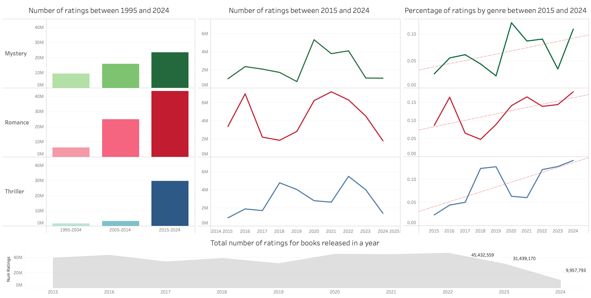
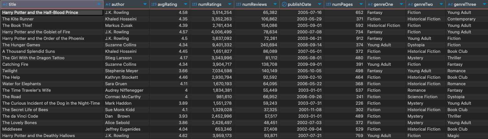

# ETL pipeline and Tableau visualtion of book trends

## Analysing book trends from ETL pipeline in tableau 

* Analysed historic and recent trends in book genre popularity to give insight into the current landscape and popularity of different book genres

* ETL pipeline implemented to automate the collection, cleaning and database storage of book information and related performance metrics 

* MySQL database used to store collected data

* Tableau visualisation tool used to present findings 

## Data 

The data used in this analysis contains information on 24,400 of the most popular books between 1950s and present day

Each book record contains
* General information (title, Author, publication date, number of pages)
* Performance metrics (average rating, number of ratings, number of reviews)
* Genre categories (primary genre, secondary genre, third genre)

## ETL framework using Python *Scrapy* library 

**Extraction**: Data was extracted from *Goodreads* using the python webscraping library *Scrapy*. 

**Transformation**: Implemented Scrapy *Itemloader* to automate removal of tags, numeric data extraction, date formatting before saving each record 

**Load**: *Scrapy* pipeline functionality used to automate insertions into MySQL database with duplicate entry checks 

## Report 

